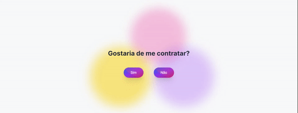

# Projeto Next.js "Me Contrate" 💼

## Descrição 📝

Bem-vindo ao projeto "Me Contrate"! Este é um projeto Next.js baseado na interação divertida e única inspirada em um pequeno jogo de um projeto anterior chamado "Quer Namorar Comigo". A ideia é envolver os usuários com a pergunta "Gostaria de me contratar?" e proporcionar uma experiência interativa ao clicar nos botões "Sim" e "Não".

## Preview 🌐

[Visite o Site](https://me-contrate.vercel.app/me/kennedysmartins) 🔗

## Como Usar 🚀

Para utilizar o projeto, siga estas etapas:

 **Escolha um Link Personalizado:**
   - Para LinkedIn: [https://me-contrate.vercel.app/in/SEU_USERNAME](https://me-contrate.vercel.app/in/SEU_USERNAME)
   - Para GitHub: [https://me-contrate.vercel.app/git/SEU_USERNAME](https://me-contrate.vercel.app/git/SEU_USERNAME)
   - Se os usernames do GitHub e do LinkedIn forem os mesmos, você pode usar: [https://me-contrate.vercel.app/me/SEU_USERNAME](https://me-contrate.vercel.app/me/SEU_USERNAME)

   Substitua "SEU_USERNAME" pelo seu nome de usuário real.

## Estrutura do Projeto 🏗️

### Arquivo `layout.tsx` 🖥️

Este arquivo contém o componente `RootLayout`, que define o layout básico da aplicação. Ele utiliza a fonte "Inter" do Google Fonts e configura metadados, como título e descrição, para melhorar a acessibilidade e a indexação nos motores de busca.

### Arquivo `page.tsx` 📄

O componente `Home` representa a página principal do projeto. Ele exibe a pergunta principal e botões interativos para os usuários responderem. Além disso, a função `generateMetadata` é responsável por fornecer metadados específicos da página para otimização de SEO.

### Componente `MainButton.tsx` 🎉

O componente `MainButton` é responsável por criar os botões interativos "Sim" e "Não". Ele incorpora um efeito de movimento divertido e um confete ao clicar no botão "Sim". O código utiliza o pacote `canvas-confetti` para criar esse efeito visual atraente.

### Componente `Modal.tsx` 🌐

O componente `Modal` exibe uma janela modal quando o usuário clica no botão "Sim". Esta janela contém uma mensagem de agradecimento, uma imagem e links para os perfis do GitHub e LinkedIn. O modal é estilizado para criar uma experiência envolvente para o usuário.

### Contribuição 🤝

Sinta-se à vontade para contribuir para o projeto "Me Contrate". Se você encontrou bugs, tem sugestões ou deseja adicionar novos recursos, abra uma issue ou envie uma pull request. Todas as contribuições são bem-vindas!

### Autor 👨‍💻

Este projeto foi desenvolvido por Kennedy Martins.

### Agradecimentos 🙌

Agradecemos por considerar contribuir para este projeto! Dê uma estrela no GitHub se você gostou da experiência "Me Contrate". 🚀

